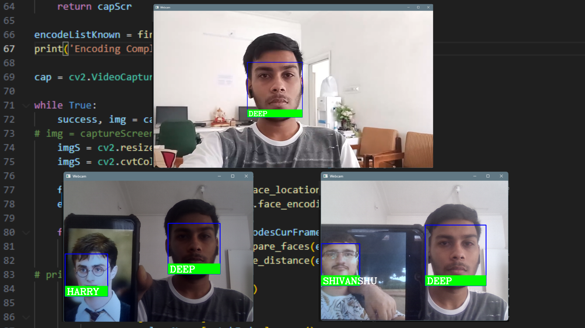

# Face Recognition Attendance System

This project implements a real-time face recognition system using `OpenCV` and `face_recognition` to automatically mark attendance. The system captures frames from a webcam, detects faces, compares them against a known dataset of images, and records attendance in a CSV file with timestamps.

 <!-- Replace with actual path -->

---

## 🚀 Features

- Real-time face detection from webcam
- Face recognition using deep learning (`face_recognition` library)
- Automatic attendance logging with timestamp
- Option to capture screen instead of webcam
- Handles repeated detections by updating existing entries

---

## 🛠️ Technologies Used

- Python 3.x
- OpenCV
- face_recognition
- NumPy
- PIL (ImageGrab for screen capture)
- CSV for attendance storage

---

## 📸 Sample Output

- Webcam window opens and shows bounding box with detected person’s name  
- `Attendance.csv` gets updated like with the person's name and time stamp like following:
  
| Name    | TIme |
| -------- | ------- |
| Deep  | 11:24:30    |
| Prayas | 12:20:11     |
| Shivanshu    | 9:40:01    |
